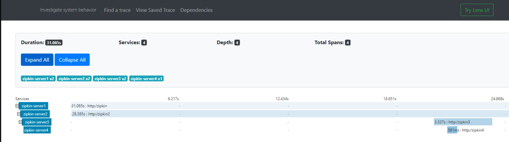

# Setup Guide

- Install minio
    - Minio has several options to install, please refer to document https://docs.min.io/ for searching to options.
    - Kindly note that after installation you would require accesskey and secretKey for login to minio
    - Once you install by default minio would run on http://localhost:9000/minio/login, On this url you should see below page
        

- Run application and upload the file
    - On minio S3 keep new bucket created with name **bucket** and also change bucket policy and make that bucket as readonly.
    - Start this as regular spring boot application.
    - This application exposes '/uploadFileAndGetLocation' as GET API ,and this API upon call uploads static file 'zipkin.PNG' on minio S3
    - After this API gets invoked this can be verified by going to the bucket and see if the file is uploaded or not. Following is reference snap.
        
    - Once you invoke the API you can verify from logs that it returns the http url of uploaded content something like http://localhost:9000/bucket/zipkin.PNG
        